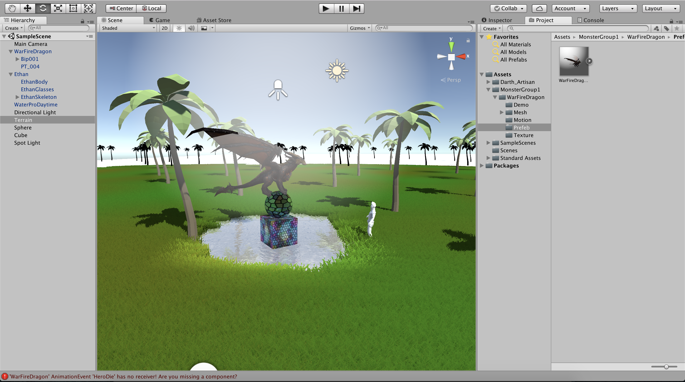

# Introducción a Unity

## Parte 1

Realizar una escena 3D básica utilizando exclusivamente el editor de escenas. La escena debe configurarse de la siguiente manera:

- Incluir dos objetos 3D básicos, por ejemplo 2 esferas.
- Incluir un personaje com Ethan, de los Standard Assets.
- Incluir un personaje de la Asset Store.
- Crear un terreno.
- Cada objeto debe tener una etiqueta que lo identifique.
- La escena debe tener 2 fuentes de luz.
- Agregar agua y árboles en el terreno.

### Screenshot al terminar

## Parte 2

Programar los scripts necesarios para las siguientes acciones:

- Cada vez que Ethan colisione con una esfera se debe incrementar un contador. Una de las escenas estará fija, la otra debe estar rodando aleatoriamente por la escena.
- La esfera que rueda debe responder a las física. Se deben incluir cilindros que actúen como sensores, de forma que cambian de color cuando Ethan o la esfera estén cerca. Se deben elegir tres tonos de intensidad que se asignarán según el estado de la colisión para cada uno de ellos. Por ejemplo, Ethan 3 tonos de rojo según entre en colisión, siga en colisión o salga de la colisión.
- Ubicar un tercer objeto que sea capaz de detectar colisiones y que se mueva con las teclas: I, L, J, M.

### GIF al terminar

